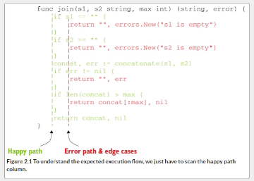

## Chapter 2: Code and project organization

**Unintended variable shadowing:**

Variable shadowing - Go variable name declared in a block can be redeclared in an inner block.


```go
var client *http.Client
if tracing {
    client, err := createClientWithTracing()
    if err != nil {
        return err
    }
    log.Println(client)
} else{
    client, err := createDefaultClient()
    if err != nil {
        return err
    }
    log.Println(client)
}
// #1 Declares a client variable
// #2 create HTTP Clients with tracing enable (shadowed in block)
// #3 Creat a default HTTP client
```
**Note:** we use the declerations operation *:=* for both the inner blocks therefore the outer block client (#1) is always *nil*

What are the solutions
1. use temp vars *c* and then *client = c* 
2. use the assignment opperator (=) and declare *err* var as type *error*

Tip: Remain causiaus  when redeclaring in inner block (may be prone to shadowing errr)

**Unnecessary nested code**
General *Rule*: The more nested elvels a function requires the more complex it is to read and understand



*fig 1.1: exapmle of code with good readbility (happy path on left edge) and return as soon as possible* 

**Misusing init functions**

*init* - function to initialize the state of an application


```go
package main
import "fmt"
var a = func() int { // (1)
    fmt.Println("var")
}()
func init() { // (2)
    fmt.Println("init")

}

func main() { // (3)
    fmt.Println("main")
}
// #1 executed first
// #2 executed second
// #3 Excuted last

```

Notes:
* init packages are executes from the import first
* if you want to prioritize execusion use *_* for a package whose side effects we want (i.e. not dirrectly referenced)
* *init* func cannot be invoked directly...


What are best practices for init functions:

**Example 1: Innopropriate use**

*Hodling a database connection pool*

```go
var db *sql.DB

func init() {
    dataSourceName := os.Gentenv("MYSQL_DATA_SOURCE_NAME")
    d, s := sql.Open("mysql", dataSourceName)
    if err != nil {
        log.Panic(err)
    }
    err = d.Ping()
    if err != nil {
        log.Panic(err)
    }
    // #1 Env variables 
    // #2 Assigns the DB Connection to the global db variables

}

```

3 downsides:
- **error management** in an init functions is limited (*panic* leads application to be stoped)
    - should not be up to the package itself whether it should stop the application
-  **testing**  - *init* function will be run before the test cases 
    - complicated to write unit tests for them
-   **Global variables** - assigns database connectiohn to a Global Var
    -  any fun can altered Global var
    -  lack of isolation

Init functions drawbacks:
- limits error management
- limits isolation (unit test are harder)
- global variables

Usefulness of init
* defining static variables


**Overusing getters and setters**

*data incapsulation - hiding the values or state of an object*

*Note: not automatic support in GO for getters and setters*

Advantages:
- encapsulate a behaviour associated with getting and setting a field
- hid internal representation
- provide a debugging interception point


Conventions (using field called *balance*)
*Balance()* - The Getter Method 
*SetPalance()* - Setter Method


**Interface Pollution:**
- overwhelming code with unneccessarity abstractions

**Interfaces are med to create abastraction. Abstractions should be discovered not created**

**When should we use Interfaces?**
- common behaviours: when multiple types implement a common behaviour (i.e. sorting)

- decoupling: if we rely on abstraction instead of a concrete implementation itself => implementation itself cna be replaces without having to change our code
    - decoupling can allow to make Unit test (mock) for both    

- Restricting behaviour: good for semantic enforcement


**Solve the problem that has to be solved now**

**Interfaces on the producer side:**
 - where should an interface live


Producer side: The interface is defined alongside the concrete implementation

Consumer side: the interface is defined where it's used

GO: WANT interface to be on consumer side


*Its up to the client to determine whether they need abstraction*

**Returning Interfaces**
- why is returning an interfaces a bad practice? It restricts flexibility

**Any Says nothing:** an empty interface type (does not convey anything)

**Generics:** allows writing code with types that can be specified later and instantiated when needed.
 
When should I use generics?
* Data structures - binary tree, nodes
* 

When should we not use generics
* when calling a method of the type Operator
* when it makes are code more complex

When creating a struct Go allows you to embeed types
- can be visible to our clients...
- embeeding can allow us to remove forwarding methods


